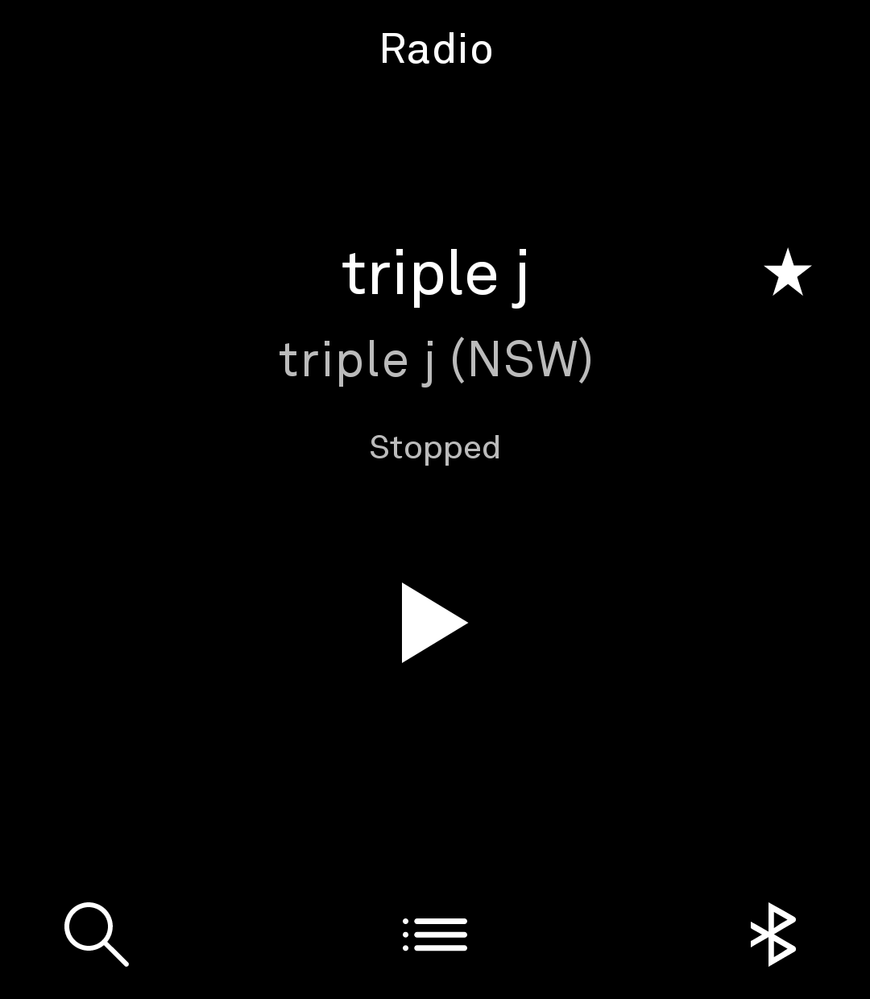
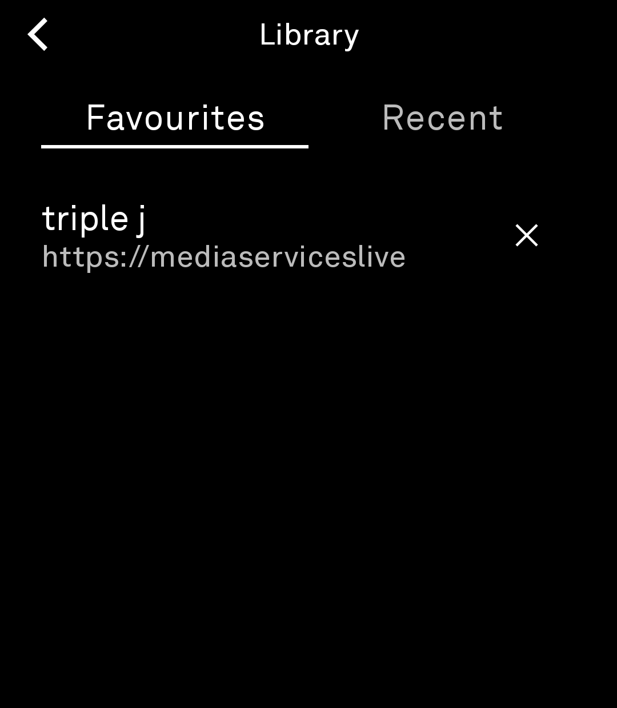

# Radio

An online radio player for the **Light Phone 3**, built as a LightOS tool on
the [light-sdk](https://github.com/lightphone/light-sdk).

Fork of [mrrobashcroft/radio-tool](https://github.com/mrrobashcroft/radio-tool),
developed and verified on a real Light Phone 3 (LP3). MIT licensed.

## Features

- **Now Playing** — no top bar; the station name and the current track
  (stream metadata) render with a 2-line clamp and pause-then-scroll marquee
  when they don't fit; large center play/stop; favourite star.
- **Background listening** — playback runs through the SDK's
  `LightAudioService` (media3/ExoPlayer) with a foreground notification.
  The wake/wifi locks are held **only while audio actually plays or
  buffers** (paused/stopped players never hold the device awake).
- **Find Stations** — one field that both searches the
  [Radio Browser](https://www.radio-browser.info) directory *and* plays a
  direct stream URL (paste any stream, with or without `https://`). Typing
  uses the embedded LightSDK keyboard (caps-start, no emoji/mic/enter —
  matching the native podcast keyboard); a "Search Results" page shows the
  results and back returns to edit the query.
- **Library** — Favourites and Recent tabs (2-line title clamp, flush-right
  delete, edge-to-edge scrollbar), persisted as JSON in the tool's files dir.
- **Bluetooth** — bottom-right glyph shows the connection state
  (`BLUETOOTH` vs the underline `BLUETOOTH_CONNECTED` variant) via the
  permission-free `LightBluetooth` SDK helper; tapping opens the system
  Bluetooth settings.
- **Volume panel** — the native LP3 volume-panel replica (canonical
  `tools/volume-panel/VolumePanelOverlay.kt`) shows on every rocker press:
  media panel while playing, ringer panel otherwise. The tool's activity
  routes the rocker to **media volume only** while the tool is open.

## Architecture

Single-module tool (no companion): `:radio` (UI) on the fork's vendored
`light-sdk` modules (`:sdk:client`, `:sdk:ui`, `:sdk:shared`).

- `serverPackage = "com.lightos"` — binds LightOS's own SDK server on a real
  LP3 (flip to `com.thelightphone.sdk.emulator` for the emulator).
- Playback is entirely tool-side (`LightAudioPlayer` → `LightMediaService`
  in the tool's process) — the server is only used for standard SDK calls.
- `LightBluetooth` / `LightVolume` (sdk:client) are permission-free helpers
  started by `LightMediaService`: they observe audio-framework state
  (`AudioDeviceCallback`, `VOLUME_CHANGED_ACTION`) so the tool never needs
  Context (the tool plugin bans it).

## Build

Requires a JDK 17 toolchain for the included build plugin (the root
`gradle.properties` or `-Porg.gradle.java.installations.paths` must point at
one), Android SDK 36, and `local.properties` with `sdk.dir`.

```bash
./gradlew :radio:assembleDebug      # debug APK
./gradlew :radio:assembleRelease    # R8-minified release APK (~6 MB)
```

Release build excludes the SDK's unused QR-scanning stack (CameraX + ML Kit)
from `sdk:client` to keep native libs out of the APK.

## Install (LP3)

```bash
adb install -r radio/build/outputs/apk/release/radio-release.apk
```

Dev builds are signed with the SDK dev keystore (`sdk/keys/lightsdk-dev.jks`),
so they sideload on a real LP3 with Developer → External tools set to
"All tools".

## Screens

Captured on a real Light Phone 3 (2026-08-19):

| | | |
|---|---|---|
|  |  |  |
|  | | |

| Screen | Notes |
|---|---|
| Home (Now Playing) | `HomeScreen.kt` — no top bar, marquee title, track line, play/stop, star |
| Find Stations | `SearchScreen.kt` — merged search/URL field, LP3 keyboard, Search Results page |
| Library | `LibraryScreen.kt` — Favourites / Recent tabs, delete, rename via title |
| Rename | `TextEntryScreens.kt` — `LightTextInputEditor`, podcast-style keyboard |

## Credits

Upstream: [mrrobashcroft/radio-tool](https://github.com/mrrobashcroft/radio-tool)
(initial build design compiled by Rob Ashcroft, August 2026). Station search
data: [Radio Browser](https://www.radio-browser.info) community API.
